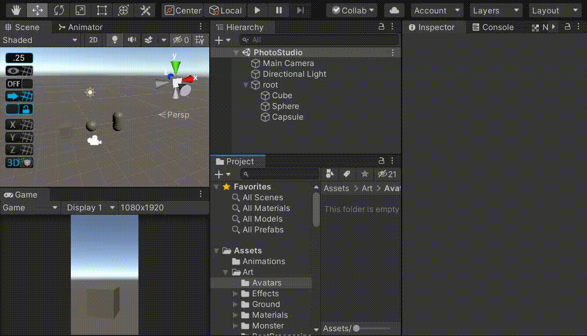

# PhotoStudio

A simple Unity tool for taking pictures for your models/characters/gameobjects.

## Installation

This is a Unity packge, just install it like a Unity packge.

## Usage

Duplicate the scene **PhotoStudio**, drag and drop your models/characters/gameobjects as children of the **root GameObject** in the duplicated scene.

Pay attention to the `CameraAutomator` and `CameraSnapshot` component.

